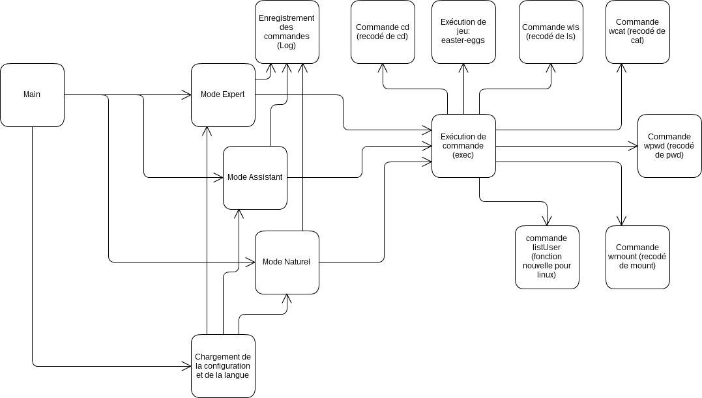

## Exia Shell
# Dossier technique
### Projet de fin d'UE

<div class="page-break"></div>
<br/>


## Le projet

Le projet **Exia Shell 2.0** consiste en la création d'un interpréteur de commandes. Cet interpréteur de commandes doit  bénéficier des fonctionalités suivantes :

* Il doit être lancé lors de la connexion d’un utilisateur au système
* Le shell doit pouvoir être configurable (équivalent .profile). Par exemple, pouvoir configurer le prompt, le mode, la langue.
* 3 modes d’utilisation du shell doivent exister :
    * mode expert, commandes comme le shell classique
    * mode assistant pas à pas
    * mode langage naturel
* Le système doit être capable de comprendre les demandes des utilisateurs dans leur propre langue (et pas seulement des abréviations en anglais).
* Il doit inclure un « easter-eggs » : les tours de Hanoï.
* L’affichage de commandes devra être plus simple et l’interprétation du contenu plus intuitif.
* Le shell tient à jour un fichier log qui trace toutes les commandes lancées par le shell (même celles qui sont erronées).

Cela vise à simplifier l'utilisation d'un shell pour les personnes n'ayant jamais utilisé d'interpreteur de commandes. En effet, les commandes à éxecuter doivent être retenues par l'utilisateur pour permettre de faire une utilisation rapide et efficace de l'interface. Les novices préférons utiliser une interface graphique bien plus simple à utiliser mais aussi beacoup plus gourmande en ressources. Pour trouver un compromis on peut mettre en place un shell qui peut comprendre des instructions plus simples ou par la navigation dans des menus.

<div class="page-break"></div>

## Répartition des tâches

Les tâches du projet on été divisées en plusieurs groupes puis chacun des membres du groupe a été assigné à une tache.

### Nicolas Mazard

|Tâche                   |10/12|11/12|12/12|13/12|14/12|15/12|16/12|17/12|
|------------------------|-----|-----|-----|-----|-----|-----|-----|-----|
|Organisation du projet  |✗   |     |     |     |     |     |     |     |
|Chargement à l'ouverture|     |     |✗   |✗   |     |     |✗   |     |
|Configuration           |     |✗   |     |     |     |     |     |     |
|Mode expert             |     |     |     |✗   |✗   |     |     |     |
|Enregistrement logs     |     |     |     |     |✗   |✗   |     |     |
|Easter Egg              |     |     |     |     |✗   |    |     |     |
|Ajustements/Debug       |     |     |     |     |✗   |✗   |✗   |     |
|Préparations            |     |     |     |     |     |     |    |✗   |

### Baptiste Saclier

|Tâche                   |10/12|11/12|12/12|13/12|14/12|15/12|16/12|17/12|
|------------------------|-----|-----|-----|-----|-----|-----|-----|-----|
|Organisation du projet  |✗   |     |     |     |     |     |     |     |
|Couleurs                |     |✗   |     |     |     |     |     |     |
|Multilangue             |     |✗   |     |     |     |     |     |     |
|Mode expert             |     |     |✗   |     |     |     |     |     |
|Mode assistant          |     |     |✗   |✗   |✗   |     |     |     |
|Mode naturel            |     |     |     |     |✗   |✗   |     |     |
|Easter Egg              |     |     |     |✗   |✗   |     |     |     |
|Ajustements/Debug       |     |     |     |     |✗   |✗   |✗   |     |
|Préparations            |     |     |     |     |     |     |    |✗   |

<div class="page-break"></div>

### Franz Alliod

|Tâche                   |10/12|11/12|12/12|13/12|14/12|15/12|16/12|17/12|
|------------------------|-----|-----|-----|-----|-----|-----|-----|-----|
|Traductions-corrections |     |     |     |     |  ✗  |  ✗ |     |     |
|Preparations            |     |     |     |     |     |     |     | ✗   |
|Codage commandes        |     |     |     |     |     |     | ✗   |     |

<div class="page-break"></div>

## Bilans personnels

### Franz Alliod

Lors de ce projet, j'ai appris comment fonctionnait un interpréteur de commande et comment l'organisé en C.
J'ai été malade et ai commencé le projet seulement à partir du 14/12, malgré mon retard, j'ai contribué au projet dans sa forme en traduisant les commandes du mode naturel, par des corrections d'orthographe et en codant certaines commandes. Par ailleurs, j'ai essayé de rattraper mon retard personnel en essayant de refaire certains modes. ( indépendament du projet )

### Baptiste Saclier

Après les prosits consacrés a la programmation en C le projet et l'aboutissement de cette fin d'année 2015. Ce projet a été une occasion de mettre en pratique les techniques de mise e place d'un programme de manière structurée pour permettre son évolution et sa bonne compréhension par les tiers. Mais aussi de mettre en place un travail de groupe et de diviser la charge pour gagner du temps. Je n'avais jamais travaillé en équipe et cette première expérience fut très probante. L'organisation était optimale grâce a l'utilisation de git et de trello permettant de partager le code et de corriger des bugs plus simplement. En bref, j'ai bien aimé ce projet, car cela m'a permis de découvrir beaucoup d'aspects des projets en équipe. Malgré ces points positifs, le sujet restait assez vague par rapport aux commandes à utiliser ou au travail à effectuer. De plus le groupe etait peut etre surqualifié et les tuteurs trop peu présents et nous avons du aider d'autres groupes.

### Nicolas Mazard

Ce projet m'a apporté beaucoup de connaissances comme l'ouverture de fichier, création entière d'une console en mode expert. Ce projet aussi m'a permis d'apprendre à utiliser des logiciels de gestion de projet comme git pour la programmation en équipe et trello pour la gestion des tâches.
Ensuite avant l'intégration dans l'école Exia.Cesi je n'ai jamais programmé en C (mais en d'autres langages oui). Cela m'a permis de créer de bonnes connaissances en langage C.
Le groupe a été modifié au dernier moment et malheureusement, nous avons fini les grosses fonctionnalités en 3-4 jours dus à notre niveau en langage C. Ce qui n'a pas été une vraie gestion de groupe (car on était au début seulement 2 membres).

## Bilan de groupe

Au niveau du groupe le nombre était réduit et Franz n'était pas espéré pour ce projet Nicolas et Baptiste on donc géré le projet pour deux personnes. Ces deux personnes ont (malheureusement) terminé la majorité des fonctionnalités dès lundi 14 décembre et il ne restait seulement que quelques bugs à corriger et quelques commandes de haut niveau à développer. Malgré cela le groupe a permis la formation d'un logiciel abouti en très peu de temps et d'organiser le code pour une éventuelle évolution. Le groupe a utilisé GIT ainsi que TRELLO permettant d'organiser les opérations a effectuer et ainsi de permettre un gain de temps et de ressources intellectuelles.

<div class="page-break"></div>

## Description de la réalisation effective du projet :

### Schéma recapitulatif



### Description

Le programme démarre par la fonction main récupérant la configuration et la langue dans une structure unique. Cette fonction appelle ensuite la fonction d'initialisation du mode demandé. Le mode attend alors l'entrée de l'utilisateur puis convertit celle-ci en un équivalent exécutable (commande) qui est ensuite exécuté par le module exec. Les commandes de base sont exécutées depuis le dossier BIN sauf certaines commandes que nous avons ajoutées comme (wls,listUser,wcat,hanoi,etc.).

<div class="page-break"></div>

# Mode d'emploi

## Introduction

Merci d'avoir choisi Exia Shell 2.0 comme Shell pour votre ordinateur. Ce guide va vous présenter les fonctionnalités de cet interpréteur de commandes qui vous fera changer votre vision du Shell.

> Dans la suite de ce mode d'emploi le nom "Exia Shell 2.0" sera remplacé par l'abreviation EXSH

## Sommaire

1. Modes d'utilisation
    1. Mode expert
    2. Mode assistant
    3. Mode naturel
2. Administration
    1. Message de bienvenue
    2. Configuration
    3. Multilangue
    4. Logging
    5. Ajouter des catégories
    6. Étoffer le mode naturel

## Mode d'utilisation

Contrairement aux autres interpréteurs de commande *EXSH* a pour vocation de faciliter au mieux l'utilisation d'un Shell. Pour ce faire, il est composé de 3 modes permettant de l'utiliser sans connaissance des commandes. On dénombre actuellement 3 modes :

**Le mode expert** : Ce mode fonctionne comme un Shell classique. L'utilisateur entre les commandes du système et celui-ci donne un résultat. Ce mode est privilégié par les administrateurs et les personnes désirant un contrôle plus précis de ce qu'il se passe sur la machine.

**Le mode assistant** : Ce mode présente une suite de catégories puis de sous catégories permettant de trier les commandes de base disponibles à l'utilisateur. Celui-ci peut alors naviguer dans des menus et voir un grand nombre de commandes disponibles sur la machine.

**Le mode naturel** : destiné aux novices, ce mode permet d'écrire en toutes lettres ce que l'on désire effectuer et l'interpréteur ira chercher dans une base de données, composé de fonctions de base, ce que l'utilisateur veut faire.

Vous trouvez ci-dessous un manuel d'utilisation détaillé pour chacun de ces modes.

### Mode expert

Le mode expert est destiné aux utilisateurs expérimentés ayant déjà eu une expérience sous un système LINUX. Dans ce mode, l'interpréteur de commandes affiche un invité de commandes personnalisable (par défaut `exsh>`) qui donne la permission à l'utilisateur d'entrer une commande.
<br/>


Une commande peut-être écrite directement si le programme qui la représente est présent dans le dossier `/bin`. Si ce n'est pas le cas, il faut préciser un chemin absolu ou relatif vers le programme. Par exemple, on peut écrire `ls` mais on ne peut exécuter un exécutable dans un autre dossier en le précédent d'un `./`.

Malgré sa complexité le mode expert permet d'opérer de manière précise et les fonctionnalités sont très larges. Ce mode est particulièrement approprié pour les administrateurs.


### Mode assistant

Le mode assistant se présente comme un arbre de commandes. Ces catégories sont munient d'une description qui permet de rendre plus explicite l'exécution des commandes. Dans ce mode, aucune commande n'est vue par l'utilisateur, mais associé à des catégories. On se déplace dans cette architecture de menu à l'aide de chiffres. Les fonctions de base sont regroupées dans des catégories permettant de facilement trouver la fonctionnalité demandée. Le mode assistant se présente de la manière suivante :


Ce mode permet de rechercher facilement une fonctionnalité et d'entrer chaque paramètre indépendamment. Ce mode est à privilégier pour les utilisateurs désirant une utilisation avancée de la machine mais sans utiliser les commandes. Malgré tous les moyens mis en oeuvre, il peut arriver que certaines commandes ne soient pas présentes et votre administrateur peut ajouter des catégories. Pour ce faire référez-vous à la section *Administration > Ajouter des catégories*

### Mode naturelles

Le mode naturel permet de rendre l'utilisation du Shell aussi simple qu'une discussion entre amis. Il suffit de décrire ce que vous voulez faire en une phrase simple et le programme se charge d'en dégager des mots clefs et de faire la correspondance avec des commandes connues.


Dans le mode naturel, certaines règles sont à respecter. Tous les chemins vers les dossiers ou les fichiers doivent toujours être précédés par un `/` ou un `./` en fonction de l'origine.

Les phrases implémentées sont limitées aux actions de base; ainsi les fonctionnalités actuellement présentent sont les suivantes :

|Fonctionalités|Paramètres|
|---|---|
|Lister le dossier actuel|Aucun|
|Lister le répertoire actuel en ordre décroissant|Aucun|
|Lister un répertoire donné|Un chemin|
|Lister un répertoire donné en ordre décroissant|Un chemin|
|Afficher le répertoire actuel|Aucun|
|Créer un fichier|Un chemin|
|Créer un dossier|Un chemin|
|Editer un fichier|Un chemin|
|Supprimer un fichier|Un chemin|
|Supprimer un dossier|Un chemin|
|Afficher un fichier|Un chemin|
|Changer son mot de passe|Aucun|
|Passer en super utilisateur|Aucun|
|Demander l'heure, la date, le jour ou l'année|Aucun|
|Lister les processus|Aucun|
|Tuer un processus|Un PID|
|Executer une commande depuis /bin|Un chemin|
|Executer un programme|Un chemin|

## Administration

EXSH est un Shell pensé pour être modulable. Nos (futurs) ingénieurs ont pensé le code source pour que toutes les données ne demandant pas de programmation soient personnalisables par l'administrateur système a l'aide de fichiers de configuration stockés dans `/etc/exsh`.

### Message de bienvenue

Au démarrage du Shell, un message de bienvenue est affiché à l'utilisateur. Ce message de bienvenue est par défaut un affichage du nom du Shell et de ces créateurs mais il est possible d'en changer à l'aide des fichiers contenus dans le dossier `/etc/exsh/motd/`. Ce dossier contient des fichiers ayant pour nom le code de langue (fr/en/de/...). En fonction de la langue choisie, un message de bienvenue différent s'affichera. Vous pouvez modifier ces fichiers et l'ensemble de ceux-ci sera affiché à l'utilisateur dès sa connexion.

### Configuration

Le fichier de configuration principal de EXSH est le fichier `/etc/exsh/profile`.Ce fichier contient simplement 3 lignes : *Mode*,*Language* et *Prompt*.

**Mode** est le mode utilisé pour toute connexion d'utilisateur.Ce paramètre peut prendre 3 valeurs différentes.

|Valeur|Mode|
|---|---|
|0|Expert|
|1|Assistant|
|2|Naturel|

**Language** ce paramètre est la langue du Shell. Ce paramètre prend pour valeur une chaîne de 2 caractères représentant le code de langue. Les langues disponibles sont pour le moment :

|Code|Langue|
|---|---|
|fr|Français|
|en|Anglais|
|es|Espagnol|

**Prompt** ce paramètre prend pour valeur une chaîne de caractères représentant le prompt personnalisé à afficher aux utilisateurs. Ce prompt sera affiché à tout utilisateur pour lui montrer qu'il peut intéragir avec le programme. Voici un exemple de prompt `exsh>` :


### Multilangue

EXSH intègre un système multilangue permettant à un utilisateur de comprendre au mieux le fonctionnement du Shell. Ce multilangue se base sur des fichiers contenus dans le dossier `/etc/exsh/lang`. Chacun des fichiers de langue a pour nom le code de langue associé et se présente dans un système de `clé=valeur`. Vous pouvez ainsi modifier une traduction ou ajouter une nouvelle langue.

### Logging

EXSH intègre un système de logging permettant de savoir à quelle date a été exécutée une commande. Le fichier de log est modifié dans `/var/log/exsh.log`.

> **ATTENTION** Il est impératif de définir les droits du fichier logs pour qu'un tiers puisse le modifier sans quoi une erreur apparaîtra durant l'execution.

Le fichier de log se présente ainsi :

```
[Tue Dec 15 11:05:09 2015]-/bin/ps -u
[Tue Dec 15 11:07:37 2015]-/bin/ls /bin
[Tue Dec 15 11:37:38 2015]-/bin/mount 15478 15478
[Tue Dec 15 11:46:52 2015]-hanoi
[Tue Dec 15 16:31:09 2015]-ls
[Tue Dec 15 16:43:27 2015]-exit
[Tue Dec 15 16:43:43 2015]-/bin/ps -u
[Tue Dec 15 16:44:04 2015]-/bin/pwd
[Wed Dec 16 09:09:39 2015]-ls
[Wed Dec 16 09:11:28 2015]-ls
```

### Ajouter des catégories

Le mode assistant se base sur un fichier de configuration pour créer l'arborescence des menus. Le fichier de configuration se trouve dans `/etc/exsh/assistant`. Ce fichier utilise une syntaxe particulière pour organiser les données.

```
assistant.process
 assistant.listProcess:/bin/ps -u
 assistant.killProcess
  assistant.killProcessNumber:/bin/kill %d|assistant.param.process
  assistant.killProcessName:/usr/bin/killall %s|assistant.param.killProcessName
```

L'exemple ci-dessus montre une catégorie ayant pour nom `assistant.process` et contenant 2 éléments `assistant.listProcess` et `assistant.killprocess`. Les noms des catégories ne sont pas écrits tels quels, mais ce sont des références au fichier de langue de l'utilisateur. On indente la ligne avec un **espace** pour organiser les données.

Pour ajouter un élément à une catégorie, vous devez mettre le bon nombre d'espaces au début pour préciser l'indentation puis mettre la référence au fichier de langues. Si vous voulez exécuter une commande dès que l'utilisateur sélectionne l'élément vous pouvez ajouter à une ligne un symbole `|` suivi de la commande exécuter.
Si votre commande demande des paramètres vous pouvez mettre un signe `%s` ou un signe `%d`. Vous devez ensuite mettre les références aux fichiers de langue séparés par des symboles `|`.

### Etoffer le mode naturel

Le mode naturel est par défaut assez sommaire mais il est possible de l'étoffer. Pour cela vous pouvez modifier les fichiers contenus dans le dossier `/etc/exsh/natural/`. Comme d'habitude, chaque fichier est propre à une langue. On écrit une ligne du mode naturel par commandes possibles.
Une ligne se décompose en 2 ou 3 parties séparées par des symboles `|`. Dans la première partie, on énumère les mots clefs requis dans la phrase qui va exécuter la commande. Les mots clefs entrés devront être tapés dans l'ordre par l'utilisateur mais pourront être entrecoupés d'autres mots. La seconde partie est la commande à exécuter de manière précise. Si la commande demande des paramètres, on peut ajouter un `%` dans la commande puis écrire dans la troisième partie le type de données à entrer à la place de `%`. Les données possibles sont `directory` pour un chemin et `number` pour un nombre.

Voici un exemple de ligne qui exécute la commande ls sur un chemin donné :

```
lister,dossier|/bin/ls % --color|directory
```

Cette ligne permet d'accepter les lignes suivantes :

* lister le dossier /bin
* peux tu lister le beau dossier du chemin ./exsh ?
